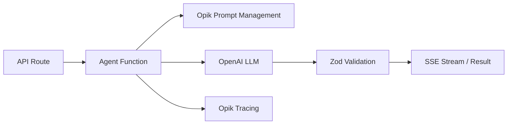

# Agents

Three LangChain agents power the core AI features. See also: [embeddings](embeddings.md) (semantic search), [opik](opik.md) (tracing & prompts).

## Common Pattern

Every agent:

1. Creates a manual Opik trace via `createAgentTrace()` for parent-level visibility
2. Fetches system and user prompts from Opik at runtime (falls back to local definitions in `lib/prompts/agentPrompts.ts`)
3. Injects `NextLevelOpikCallbackHandler` into LangChain for child span tracing
4. Validates LLM output with Zod schemas (`lib/validation/schemas.ts`)
5. Handles errors with `parseErrorInfo()` and reports them to traces

## UserSkillAgent

**File:** `lib/agents/UserSkillAgent.ts`
**Model:** `gpt-5-mini` (streaming)
**API:** `GET /api/skill/stream`

Suggests career development skills based on a user's role, current skills, and career goals.

**Flow:**

1. Builds system + user prompts with user profile variables
2. Streams LLM response, parsing JSON Lines incrementally (one `{name, priority, reasoning}` object per line)
3. Validates each line against `SkillSchema` and yields as a `skill` event
4. Yields `complete` event with all emitted skills

**Output:** Up to 4 skills (`SKILLS_PER_USER`), each with name, priority (1-4), and reasoning.

**Stream events:** `token` | `skill` | `complete`

## SkillResourceRetrieverAgent

**File:** `lib/agents/SkillResourceRetrieverAgent.ts`
**Model:** `gpt-4o-mini` (non-streaming, for query generation)
**API:** `GET /api/users/[id]/goals/[goalId]/resources/stream`

Finds curated learning resources relevant to a user's goal using semantic search.

**Flow:**

1. Generates up to 5 search queries via LLM with `json_schema` response format, validated against `SearchQueriesSchema`
2. For each query, calls `searchCuratedResources(query, 3)` which:
   - Embeds the query with OpenAI
   - Searches pgvector with 2x limit for dedup headroom
   - Filters by similarity >= 0.5
   - Returns unique resources ranked by best match
3. Deduplicates across queries, streams each resource as a `resource` event
4. Stops after 5 unique resources (`MAX_RESOURCES`)

Each search is traced as a `tool` span under the parent trace.

**Stream events:** `token` | `resource` | `complete`

## ChallengeGeneratorAgent

**File:** `lib/agents/ChallengeGeneratorAgent.ts`
**Model:** `gpt-5-mini` (streaming)
**API:** `POST /api/users/[id]/goals/[goalId]/challenges` (triggers background job)

Generates multiple-choice quiz questions for each section of a learning resource.

**Flow:**

1. Called by `generateChallengesJob` which creates challenges per section and difficulty
2. For each challenge, `generateChallengeQuestions()`:
   - Builds prompts with section context, difficulty level, user profile, and goal
   - Streams LLM response and accumulates full content
   - Extracts JSON (strips markdown fences if present), validates against `generatedQuestionsSchema`
   - Enforces exact question count (`QUESTIONS_PER_CHALLENGE = 10`)
3. `processChallengeGeneration()` wraps generation with status updates: `pending` -> `generating` -> `complete` / `failed`
4. `generateAllChallengesForGoal()` orchestrates all challenges sequentially under a single trace

**Output per challenge:** 10 questions, each with question text, 4 options (A-D), correct answer, explanation, and optional hint.

**Difficulty levels:** `easy` (basic recall), `medium` (applying knowledge), `hard` (deep understanding and critical thinking)

## Models

| Agent | Model | Mode |
|---|---|---|
| UserSkillAgent | `gpt-5-mini` | Streaming |
| SkillResourceRetrieverAgent | `gpt-4o-mini` | Non-streaming |
| ChallengeGeneratorAgent | `gpt-5-mini` | Streaming |

LLM instances are created via `createLLM()` / `createStreamingLLM()` in `lib/utils/llm.ts`.

## Key Files

| File | Purpose |
|---|---|
| `lib/agents/UserSkillAgent.ts` | Skill suggestion agent |
| `lib/agents/SkillResourceRetrieverAgent.ts` | Resource retrieval agent |
| `lib/agents/ChallengeGeneratorAgent.ts` | Quiz generation agent |
| `lib/agents/utils.ts` | Shared `parseErrorInfo()` helper |
| `lib/utils/llm.ts` | LLM factory (`createLLM`, `createStreamingLLM`) |
| `lib/validation/schemas.ts` | Zod schemas for all agent outputs |
| `lib/prompts/agentPrompts.ts` | Local prompt definitions and constants |
| `lib/jobs/generateChallengesJob.ts` | Background job orchestrating challenge generation |
