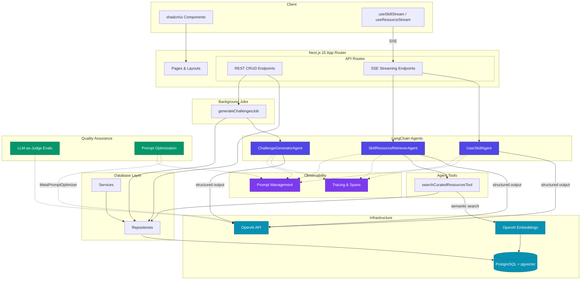

# Architecture Diagram

```mermaid
graph TB
    subgraph Client["Client"]
        UI[shadcn/ui Components]
        Hooks[useSkillStream / useResourceStream]
    end

    subgraph NextJS["Next.js 15 App Router"]
        subgraph API["API Routes"]
            REST[REST CRUD Endpoints]
            SSE[SSE Streaming Endpoints]
        end
        Pages[Pages & Layouts]
    end

    subgraph Agents["LangChain Agents"]
        USA[UserSkillAgent]
        SRA[SkillResourceRetrieverAgent]
        CGA[ChallengeGeneratorAgent]
    end

    subgraph Tools["Agent Tools"]
        SCR[searchCuratedResourcesTool]
    end

    subgraph DB["Database Layer"]
        Repos[Repositories]
        Services[Services]
    end

    subgraph Infra["Infrastructure"]
        PG[(PostgreSQL + pgvector)]
        OpenAI[OpenAI API]
        Embeddings[OpenAI Embeddings]
    end

    subgraph Observability["Observability"]
        Tracing[Tracing & Spans]
        Prompts[Prompt Management]
    end

    subgraph QA["Quality Assurance"]
        Evals[LLM-as-Judge Evals]
        Optimize[Prompt Optimization]
    end

    subgraph Jobs["Background Jobs"]
        ChallengeJob[generateChallengesJob]
    end

    %% Client to Next.js
    UI --> Pages
    Hooks -->|SSE| SSE

    %% Next.js to Agents
    REST --> Repos
    REST --> ChallengeJob
    SSE --> USA
    SSE --> SRA

    %% Agents to dependencies
    USA -->|structured output| OpenAI
    SRA -->|structured output| OpenAI
    SRA --> SCR
    CGA -->|structured output| OpenAI

    %% Tools to DB
    SCR -->|semantic search| Embeddings
    SCR --> Repos

    %% Jobs
    ChallengeJob --> CGA
    ChallengeJob --> Repos

    %% DB Layer
    Repos --> PG
    Services --> Repos

    %% Embeddings
    Embeddings --> PG

    %% Observability
    USA -.-> Tracing
    SRA -.-> Tracing
    CGA -.-> Tracing
    USA -.-> Prompts
    SRA -.-> Prompts
    CGA -.-> Prompts

    %% QA
    Evals -.-> OpenAI
    Optimize -.->|MetaPromptOptimizer| OpenAI
    Optimize -.-> Prompts

    %% Styling
    classDef agent fill:#4f46e5,stroke:#3730a3,color:#fff
    classDef infra fill:#0891b2,stroke:#0e7490,color:#fff
    classDef obs fill:#7c3aed,stroke:#6d28d9,color:#fff
    classDef qa fill:#059669,stroke:#047857,color:#fff

    class USA,SRA,CGA agent
    class PG,OpenAI,Embeddings infra
    class Tracing,Prompts obs
    class Evals,Optimize qa
```
