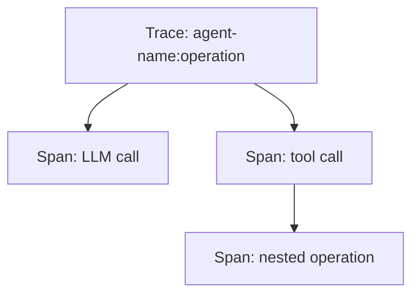

# Observability

Opik provides tracing, prompt management, evaluations, and prompt optimization across the full LLM lifecycle.

## Tracing

Every agent call produces a hierarchical trace with parent and child spans.

**How it works:**

1. `createAgentTrace()` (`lib/opik.ts`) creates a manual parent trace with agent name, operation, input, metadata, and tags
2. `NextLevelOpikCallbackHandler` (`lib/trace/handler.ts`) is injected into LangChain as a callback — it automatically creates child spans for LLM calls, chain steps, tool invocations, and retriever operations
3. The handler accepts a `parent` option to attach all LangChain spans under the manual trace, giving a single hierarchical view per agent invocation

**What gets traced:**

- LLM inputs/outputs and token usage (prompt, completion, total tokens)
- Tool calls with inputs and results
- Errors with exception type, message, and stack trace
- Custom scores (e.g. `needs_review` on question count mismatches)

**Key detail:** The `NextLevelOpikCallbackHandler` is a fork of `OpikCallbackHandler` from `opik-langchain`, extended with parent injection support. Without parent injection, LangChain callbacks create disconnected root traces instead of nesting under the agent's manual trace.

## Prompt Management

Agent prompts are versioned in Opik and fetched at runtime with a 5-minute cache (`lib/prompts/promptManager.ts`).

- **Runtime:** `getAgentPrompt(name, variables)` fetches from Opik, falls back to local definitions in `lib/prompts/agentPrompts.ts`
- **Sync:** `npm run prompts:sync` pushes local prompt definitions to Opik
- **Variables:** Mustache-style `{{variableName}}`, sanitized against prototype pollution before substitution

## Evaluations

LLM-as-judge pipeline (`evals/run.ts`) using Opik's `evaluate()` function.

- **Metrics:** Hallucination, AnswerRelevance, Usefulness (all built-in Opik metrics)
- **Judge model:** `gpt-5-mini`
- **Datasets:** Local JSON files in `evals/datasets/` or loaded from Opik platform
- **Agents evaluated:** user-skill-agent, skill-resource-retriever, challenge-generator

## Prompt Optimization

Python-based optimization (`optimize/`) using `opik-optimizer`.

- `MetaPromptOptimizer` generates prompt candidates, evaluates them against Opik datasets with AnswerRelevance, and selects the best performing variant
- One optimizer script per agent in `optimize/meta_optimizers/`
- `run_all.py` runs all three sequentially

## Key Files

| File | Purpose |
|---|---|
| `lib/opik.ts` | Opik client, `createAgentTrace()`, `createOpikHandler()` |
| `lib/trace/handler.ts` | `NextLevelOpikCallbackHandler` with parent injection |
| `lib/prompts/promptManager.ts` | Prompt fetching, caching, sync, variable substitution |
| `lib/prompts/agentPrompts.ts` | Local prompt definitions and constants |
| `evals/run.ts` | Evaluation CLI runner |
| `optimize/run_all.py` | Prompt optimization orchestrator |
