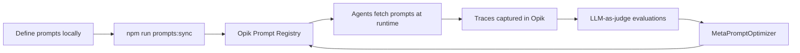

# Opik Integration

See also: [agents](agents.md) | [embeddings](embeddings.md) | [scheduling](scheduling.md) | [architecture](architecture.md).

Next Level uses [Opik](https://www.comet.com/docs/opik/) for full LLM observability: tracing, prompt management, evaluations, and prompt optimization.

## What We Trace

Every LLM call captures: **prompts**, **generations**, **model**, **provider**, **token usage**, and **invocation params** — all fed into hierarchical Opik traces via `NextLevelOpikCallbackHandler`.

## Environment Variables

| Variable            | Description                                 |
| ------------------- | ------------------------------------------- |
| `OPIK_API_KEY`      | Opik API key (tracing disabled when absent) |
| `OPIK_WORKSPACE`    | Opik workspace                              |
| `OPIK_PROJECT_NAME` | Project for traces and prompts              |

## Tracing Architecture

### [`NextLevelOpikCallbackHandler`](../lib/trace/handler.ts)

Custom LangChain `BaseCallbackHandler` (forked from `opik-langchain`) that handles all tracing. Key feature: **parent injection** — accepts an existing `Trace` or `Span` and nests all LangChain-generated spans under it, avoiding the duplicate traces.

```typescript
const trace = createAgentTrace('agent-name', 'operation', { input, metadata, tags });
const llmSpan = trace?.span({ name: 'llm-call', type: 'llm' });

const traceHandler = new NextLevelOpikCallbackHandler({ parent: llmSpan });

try {
  const stream = await llm.stream(messages, { callbacks: [traceHandler] });
  // ... process stream ...
} catch (error) {
  llmSpan?.update({ errorInfo: { ... }, endTime: new Date() });
  throw error;
}

llmSpan?.update({ output: { ... }, endTime: new Date() });
```

Handles all LangChain lifecycle events: `handleChatModelStart`, `handleLLMEnd`, `handleChainStart/End`, `handleToolStart/End`, `handleRetrieverStart/End`, `handleAgentAction/End`.

## Trace Hierarchies

### UserSkillAgent — `streamSkillSuggestions()`

```
[Trace] user-skill-agent:stream
  └── [Span:llm] user-skill-agent:stream  (auto-created by callback handler)
```

### SkillResourceRetrieverAgent — `streamResources()`

```
[Trace] skill-resource-retriever-agent:stream
  ├── [Span:llm]  gpt-4o-mini  (auto-created by callback handler, query generation)
  ├── [Span:tool] search-curated-resources  ← query 1  (manual span)
  ├── [Span:tool] search-curated-resources  ← query 2  (manual span)
  └── [Span:tool] search-curated-resources  ← query N  (manual span)
```

### ChallengeGeneratorAgent — `generateAllChallengesForGoal()`

```
[Trace] challenge-generator-agent:generate-all
  ├── [Span:general] process-challenge:<section>:easy
  │    └── [Span:general] generate-questions
  │         └── [Span:llm] gpt-5-mini  (auto-created by callback handler)
  ├── [Span:general] process-challenge:<section>:medium
  │    └── [Span:general] generate-questions
  │         └── [Span:llm] gpt-5-mini  (auto-created by callback handler)
  └── ...
```

## Automated Span Scoring

The `ChallengeGeneratorAgent` attaches a score directly to the `generate-questions` span when the LLM returns an unexpected question count:

```typescript
generateQuestionsSpan?.score({
  name: 'needs_review',
  value: 0,
  reason: `Expected ${QUESTIONS_PER_CHALLENGE} questions but got ${questions.length}`,
  categoryName: 'question_count_mismatch'
});
```

This makes mismatches filterable in the Opik dashboard. The trace is also tagged with `['review', 'question-count-mismatch']` for easy discovery.

## Trace Metadata

Every trace carries structured metadata for filtering and debugging in the Opik dashboard. Metadata is built in layers:

### [`Base metadata`](../lib/opik.ts)

All traces automatically include:

| Key           | Value                       |
| ------------- | --------------------------- |
| `environment` | `process.env.NODE_ENV`      |
| `version`     | `'1.0.0'`                   |
| `agentName`   | The agent identifier string |

### Per-agent metadata

Each agent merges additional keys via the `metadata` option:

| Agent                                       | Extra keys                                         |
| ------------------------------------------- | -------------------------------------------------- |
| **UserSkillAgent**                          | `userId`                                           |
| **SkillResourceRetrieverAgent**             | `userId`, `goalId`                                 |
| **ChallengeGeneratorAgent** (per challenge) | `goalId`, `challengeId`, `sectionId`, `difficulty` |
| **ChallengeGeneratorAgent** (top-level)     | `goalId`, `userId`, `resourceId`                   |

### Auto-captured LangChain metadata (`NextLevelOpikCallbackHandler`)

The callback handler extracts metadata from LangChain's internal run context and attaches it to spans:

| Key               | Source                                  |
| ----------------- | --------------------------------------- |
| `ls_provider`     | LLM provider (e.g. `openai`)            |
| `ls_model_name`   | Model identifier (e.g. `gpt-5-mini`)    |
| `tools`           | Tool definitions from invocation params |
| Invocation params | Temperature, top_p, etc.                |

### [`Prompt metadata`](../lib/prompts/agentPrompts.ts)

Each prompt definition includes metadata for the Opik prompt registry:

| Key         | Example values                                      |
| ----------- | --------------------------------------------------- |
| `agent`     | `'user-skill-agent'`, `'challenge-generator-agent'` |
| `type`      | `'system-prompt'`, `'user-prompt'`                  |
| `operation` | `'generate'`, `'search'`                            |
| `category`  | `'career-development'`, `'resource-discovery'`      |

## Prompt Management

Prompts are managed through Opik and fetched at runtime with local fallback and 5-minute caching.

```typescript
const prompt = await getAgentPrompt('agent-name:prompt-key', { variableName: 'value' });
```

```bash
npm run prompts:sync  # Push local prompts to Opik
```

## Evaluations (LLM-as-Judge)

Runs agents against test datasets and scores output quality using Opik's built-in LLM-as-judge metrics. Judge model: **`gpt-5-mini`**.

### Metrics

| Metric              | What it checks                                      |
| ------------------- | --------------------------------------------------- |
| **Hallucination**   | Is the output grounded in context (not fabricated)? |
| **AnswerRelevance** | Is the output relevant to the input prompt?         |
| **Usefulness**      | Is the output practically useful for the user?      |

### Evaluated Agents

| CLI key                    | Agent                       | Dataset                                                               |
| -------------------------- | --------------------------- | --------------------------------------------------------------------- |
| `user-skill-agent`         | UserSkillAgent              | [`dataset`](../evals/datasets/user-skill-agent.json)               |
| `skill-resource-retriever` | SkillResourceRetrieverAgent | [`dataset`](../evals/datasets/skill-resource-retriever-agent.json) |
| `challenge-generator`      | ChallengeGeneratorAgent     | [`dataset`](../evals/datasets/challenge-generator-agent.json)      |

### How it works

1. **Dataset loading** — Test fixtures from local JSON or the Opik platform (`--source opik`).
2. **DB seeding** — `evals/seed.ts` populates the database with test data so agents can run against real records.
3. **Task execution** — Each task function (`evals/tasks/*.ts`) calls the real agent and returns `{ input, output, context }` for the judges.
4. **Scoring** — Opik's `evaluate()` runs the three judge metrics against each task result.
5. **Results** — Stored as Opik experiments linked to their datasets, viewable in the Opik dashboard.

### Task function contract

Each task must return:

```typescript
{ input: string, output: string, context: string[] }
```

- `input` — The system prompt or instruction given to the agent.
- `output` — The agent's actual output (JSON stringified).
- `context` — Grounding facts for the Hallucination metric (user info, goal, resource details).

### CLI usage

```bash
npx tsx evals/run.ts --agent user-skill-agent                    # single agent
npx tsx evals/run.ts --all --samples 2                            # all agents, limit samples
npx tsx evals/run.ts --agent challenge-generator --source opik    # load from Opik platform
npx tsx evals/run.ts --all --verbose                              # detailed per-test output
```

Results are stored as Opik experiments linked to their datasets.

## Prompt Optimization (Python)

Automated prompt improvement using `opik-optimizer` (`optimize/`). Each agent has a dedicated optimizer script that generates prompt candidates, evaluates them, and selects the best variant.

### How it works

1. **Load prompts and datasets** from Opik via the Python SDK
2. **MetaPromptOptimizer** generates candidate prompts (4 per round, 8 threads, temperature 0.0, seed 42)
3. Each candidate is evaluated against the agent's Opik dataset using **AnswerRelevance** as the scoring metric
4. Best-performing prompt variant is displayed with scores

### Optimizer scripts

| Script                                                 | Agent                       | Model         |
| ------------------------------------------------------ | --------------------------- | ------------- |
| `optimize/meta_optimizers/user_skill_agent.py`         | UserSkillAgent              | `gpt-4o-mini` |
| `optimize/meta_optimizers/skill_resource_retriever.py` | SkillResourceRetrieverAgent | `gpt-4o-mini` |
| `optimize/meta_optimizers/challenge_generator.py`      | ChallengeGeneratorAgent     | `gpt-4o-mini` |

### CLI usage

```bash
cd optimize
python run_all.py                                    # Run all optimizers
python meta_optimizers/user_skill_agent.py           # Single agent
```

## Full Lifecycle Overview


