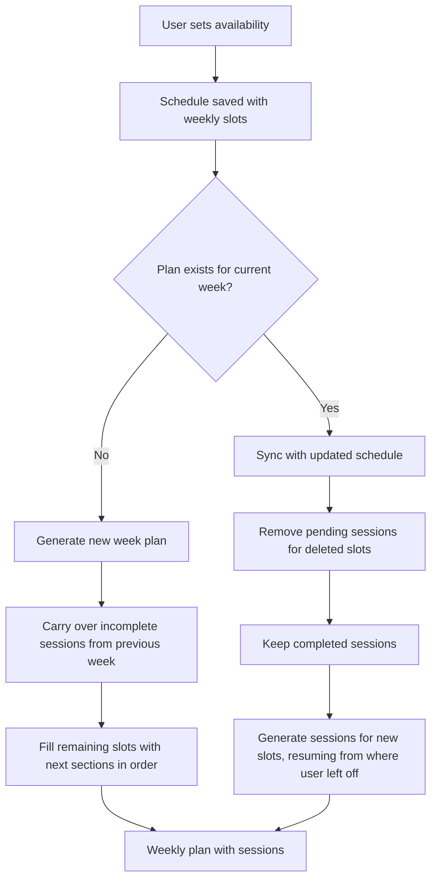

# Adaptive Weekly Plan Scheduling

The weekly plan system uses a deterministic, greedy slot-filling algorithm to distribute learning resource sections across a user's availability slots. No AI is involved — plans are generated purely from schedule data, resource structure, and completion state.

## How It Works

## Key Properties

- **Deterministic** — same inputs always produce the same plan
- **Order-preserving** — sections are always assigned in `orderIndex` order, maintaining course progression
- **Incremental** — schedule changes only affect the current week; past weeks remain intact
- **Completion-aware** — completed work is never lost or reassigned
